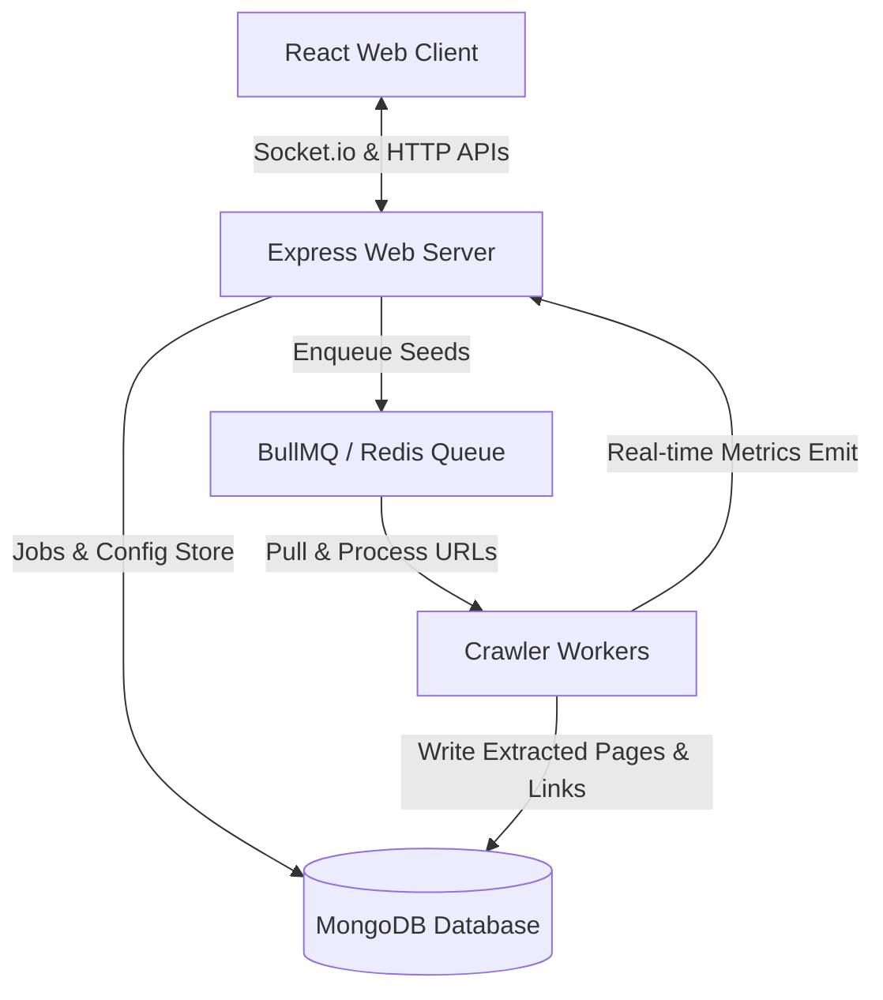

# Distributed Web Crawler

A robust, high-performance, and scalable full-stack **Distributed Web Crawler** application. Built with **Node.js**, **Express**, **BullMQ (Redis)**, **MongoDB (Mongoose)**, **Socket.io**, and **React (Vite)**, this project enables real-time crawler task creation, job queuing, concurrent worker processing, HTML parsing, link discovery, and live visualization of crawl progress.

---

## 🚀 Key Features

*   **Real-time Monitoring & Dashboard:** Watch jobs update in real-time. Live stats, progress counters, and error states are emitted from the worker node to the frontend React UI via Socket.io.
*   **Job & Queue Management:** Schedule crawl jobs with customized rules like **Seed URL**, **Max Depth**, and **Max Pages**. Jobs can also be paused or stopped on the fly.
*   **Distributed Architecture:** Leverages **BullMQ** and **Redis** to enqueue crawl jobs. Multiple crawler workers process the queue concurrently (default concurrency: 5 parallel workers per node).
*   **HTML Parsing & Metadata Extraction:** Crawled pages are parsed using **Cheerio** to extract details such as page titles, meta descriptions, text contents, and outgoing links.
*   **Storage & Analytics:** Page content and discovered parent-child links are saved in **MongoDB** for indexing, graphing, and visualization.
*   **Visual User Interface:** Modern, clean, and intuitive dashboard built with React + Vite to start new crawls, review history, and view scraped results.

---

## 🏗️ System Architecture

The crawler is built as a split client-server-worker model:



---

## 🛠️ Technology Stack

### Backend
*   **Node.js & Express:** Hosts rest APIs and socket server.
*   **BullMQ:** Powerful task queuing built on top of Redis for high-throughput job isolation and concurrency.
*   **ioredis:** Fast Redis client for BullMQ database integration.
*   **Mongoose & MongoDB:** Database schema wrapper and document storage for persistence.
*   **Cheerio:** Fast, flexible, and lean implementation of core jQuery designed specifically for the server, used to extract DOM structures.
*   **Axios:** Promise-based HTTP client to fetch target pages with customized headers and timeouts.
*   **Socket.io:** WebSockets framework for real-time bidirectional communication.

### Frontend
*   **React (Vite):** A fast build tool and framework for single-page applications.
*   **React Router DOM:** Application routing logic (`/`, `/jobs`, `/results`).
*   **Socket.io-client:** Receives crawl metrics and status changes instantly.
*   **Pure CSS:** Modern responsive design layouts and components.

---

## 📁 Directory Structure

```text
distributed_web_crawler/
├── backend/
│   ├── APIs/               # Express routing endpoints (jobs, pages, stats)
│   │   ├── jobs.js
│   │   ├── pages.js
│   │   └── stats.js
│   ├── models/             # Mongoose schemas (Job, Page, Link)
│   │   ├── Job.js
│   │   ├── Link.js
│   │   └── Page.js
│   ├── queue/              # BullMQ queue init and worker callbacks
│   │   └── urlQueue.js
│   ├── workers/            # Scraper logic, parser and DB persistence
│   │   └── crawlerWorker.js
│   ├── .env                # Local environment variables
│   ├── server.js           # Server startup script (API and WebSockets)
│   └── package.json
├── frontend/
│   ├── public/             # Static public assets
│   ├── src/
│   │   ├── components/     # Reusable layout UI components
│   │   │   ├── JobTable.jsx
│   │   │   ├── Navbar.jsx
│   │   │   └── StatCard.jsx
│   │   ├── pages/          # Primary views (Dashboard, Jobs, Results)
│   │   │   ├── Dashboard.jsx
│   │   │   ├── Jobs.jsx
│   │   │   └── Results.jsx
│   │   ├── App.css
│   │   ├── App.jsx
│   │   ├── index.css
│   │   └── main.jsx
│   ├── package.json
│   └── vite.config.js
└── README.md               # Documentation (This file)
```

---

## ⚡ Setup & Installation

### Prerequisites
1.  **Node.js** (v18.x or above recommended)
2.  **MongoDB** (Local instance or MongoDB Atlas URI)
3.  **Redis Server** (Defaulting to port `6379`)

### 1. Backend Setup
1.  Navigate to the `/backend` directory:
    ```bash
    cd backend
    ```
2.  Install dependencies:
    ```bash
    npm install
    ```
3.  Create a `.env` file in the `/backend` directory:
    ```env
    PORT=5000
    MONGODB_URI=mongodb://localhost:27017/webcrawler
    REDIS_HOST=localhost
    REDIS_PORT=6379
    ```
4.  Start the Express server & Crawler workers:
    ```bash
    npm start
    # or using node directly:
    node server.js
    ```

### 2. Frontend Setup
1.  Navigate to the `/frontend` directory:
    ```bash
    cd ../frontend
    ```
2.  Install dependencies:
    ```bash
    npm install
    ```
3.  Start the development server:
    ```bash
    npm run dev
    ```
4.  Open your browser and navigate to `http://localhost:5173`.

---

## 📡 API Reference

### Crawl Jobs
*   **POST** `/api/jobs` - Starts a new crawl job.
    *   **Body parameters:**
        *   `seedUrl` (string, required): The URL where crawling begins.
        *   `depth` (number, optional, default: `2`): Levels of links to follow recursively.
        *   `maxPages` (number, optional, default: `100`): Threshold of maximum pages to crawl.
*   **GET** `/api/jobs` - Retrieves a list of all crawl jobs.
*   **GET** `/api/jobs/:id` - Fetches metadata for a specific job.
*   **PATCH** `/api/jobs/:id/pause` - Pauses a currently running job.
*   **PATCH** `/api/jobs/:id/stop` - Halts a job and sets its status to `failed`.

### Crawled Pages
*   **GET** `/api/pages` - Returns the latest 50 crawled pages.
*   **GET** `/api/pages/job/:jobId` - Returns all pages scraped under a specific crawl job ID.
*   **GET** `/api/pages/:id` - Returns details for a single crawled page document.

### Stats & Analytics
*   **GET** `/api/stats` - Overall stats (total jobs, pages crawled, links found, running jobs).
*   **GET** `/api/stats/job/:id` - Gets precise statistics for a specific crawl job (pages count, pending/crawled links).

---

## ⚙️ How It Works: Queue and Concurrency

1.  **Job Initialization:** When you submit a target URL via the UI, Express inserts a new `job` document into MongoDB.
2.  **Seed Enqueue:** The root seed URL is enqueued into `crawlQueue` with an initial depth level of `0`.
3.  **Concurrency Dispatch:** A `BullMQ` Worker reads from the queue. Concurrency is configured at `5`, allowing up to 5 worker threads to run simultaneously per process.
4.  **Parsing & Discovery:**
    *   The crawler downloads the page source using Axios.
    *   Cheerio extracts all raw anchor tag href values matching `http*`.
    *   The page metadata (title, content, statusCode) is saved.
    *   Discovered child links are recorded in MongoDB with `isCrawled: false`.
5.  **Recursive Spawning:** For each discovered link, if the current depth is less than the job's `maxDepth`, the link is added back into the Redis queue with depth incremented by `1`.
6.  **Crawl Complete:** When the `pagesCount` matches or exceeds `maxPages` or the queue naturally drains, the job updates to `completed`.
